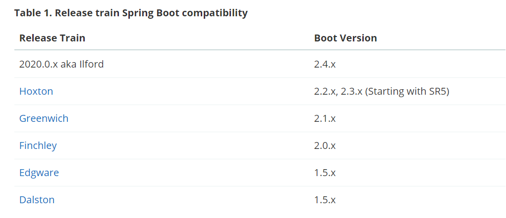

## 雨巷学院

## 版本

### 注意：运行项目需要联网，需要将服务注册到Nacos注册中心上，已经关键配置需要从Nacos上获取。

* Spring Boot          ==> 2.2.11.RELEASE
* Spring Cloud         ==> Hoxton.SR5
* Spring Cloud Alibaba ==> 2.2.0.RELEASE
* aliyun-spring-boot-dependencies ==> 1.0.0

## 模块
* **common 通用模块**
    * common-util `通用包`
    * service-base `服务基础模块，所有服务都需引入`
* **infrastructure 基础设施**
    * api-gateway `网关服务`    port=9600
* **service 服务模块**
    * service-ams           `广告服务` port=9610
        * 功能：广告推荐
    * service-core          `资源信息服务` port=9620
        * 功能：课程操作，讲师操作
    * service-mms           `通信服务` port=9630
        * 功能：聊天，聊天室
    * service-oss           `对象存储服务` port=9640
        * 功能：阿里云OSS对象存储
    * service-sms           `短信息服务` port=9650
        * 功能：手机验证码发送，邮件验证码发送
    * service-statistice    `统计服务` port=9660
        * 功能：统计用户注册，统计日访问量......
    * service-trade         `订单服务` port=9670
        * 功能：查询订单，购买课程
    * service-ucenter       `用户中心服务` port=9999
        * 功能：用户注册，用户登录，颁发Token，Token信息解码
    * service-vod           `视频点播服务` port=9690
        * 功能：阿里云VOD视频点播，讲师可以进行直播

    
    
## 已开发功能

service-ams：广告分类操作，广告操作
service-core：核心功能操作
service-ucenter：用户注册，用户登录，颁发Token，Token信息解码，微博第三方登录
service-sms：手机验证码发送，邮件验证码发送
service-oss：文件对象操作
service-vod：视频点播操作，视频直播操作
service-statistice：统计用户注册，统计信息Excel导出
service-mms：直播聊天室
service-trade：订单操作，支付宝【沙箱】支付

api-gateway：统一URL鉴权

## 未开发公能

讲师开播操作的前端界面
后台管理权限设计
全局搜索功能
评论功能
